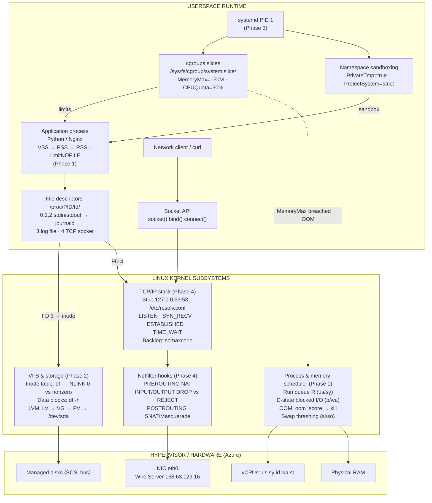

# Linux Userspace to Kernel to Azure Hardware


```mermaid
flowchart TB
  subgraph US["USERSPACE RUNTIME"]
    SD["systemd PID 1<br/>(Phase 3)"]
    CG["cgroups slices<br/>/sys/fs/cgroup/system.slice/<br/>MemoryMax=150M · CPUQuota=50%"]
    NS["Namespace sandboxing<br/>PrivateTmp=true · ProtectSystem=strict"]
    APP["Application process<br/>Python / Nginx<br/>VSS → PSS → RSS · LimitNOFILE<br/>(Phase 1)"]
    FD["File descriptors /proc/PID/fd/<br/>0,1,2 stdin/stdout → journald<br/>3 log file · 4 TCP socket"]
    CLI["Network client / curl"]
    SOCK["Socket API<br/>socket() bind() connect()"]
    SD --> CG
    SD --> NS
    CG -->|limits| APP
    NS -->|sandbox| APP
    APP --> FD
    CLI --> SOCK
  end

  subgraph K["LINUX KERNEL SUBSYSTEMS"]
    VFS["VFS & storage (Phase 2)<br/>Inode table: df -i · NLINK 0 vs nonzero<br/>Data blocks: df -h<br/>LVM: LV → VG → PV → /dev/sda"]
    SCHED["Process & memory scheduler (Phase 1)<br/>Run queue R (us/sy)<br/>D-state blocked I/O (b/wa)<br/>OOM: oom_score → kill<br/>Swap thrashing (si/so)"]
    NET["TCP/IP stack (Phase 4)<br/>Stub 127.0.0.53:53 · /etc/resolv.conf<br/>LISTEN · SYN_RECV · ESTABLISHED · TIME_WAIT<br/>Backlog: somaxconn"]
    NF["Netfilter hooks (Phase 4)<br/>PREROUTING NAT<br/>INPUT/OUTPUT DROP vs REJECT<br/>POSTROUTING SNAT/Masquerade"]
    NET --> NF
  end

  subgraph HW["HYPERVISOR / HARDWARE (Azure)"]
    DISK["Managed disks (SCSI bus)"]
    CPU["vCPUs: us sy id wa st"]
    RAM["Physical RAM"]
    NIC["NIC eth0<br/>Wire Server 168.63.129.16"]
  end

  FD -->|FD 3 → inode| VFS
  FD -->|FD 4| NET
  SOCK --> NET
  CG -.->|MemoryMax breached → OOM| SCHED
  VFS --> DISK
  SCHED --> CPU
  SCHED --> RAM
  NF --> NIC
```

<details>
<summary>ASCII version (plain-text fallback)</summary>

```text
<paste your original ASCII here>
```

</details>
